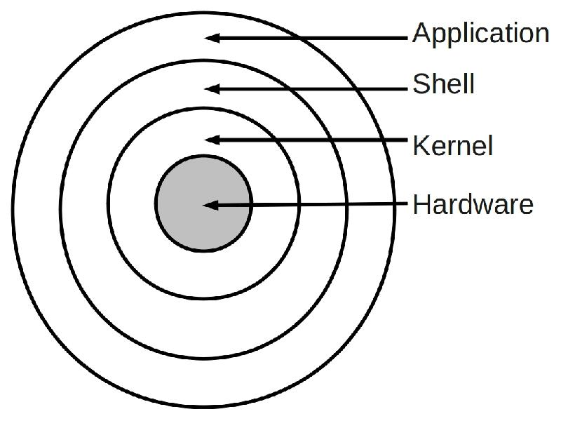

# Lecture 1: Linux Basic & Shell Script

本课程参考[MIT](https://web.mit.edu/)课程[The Missing Semester of Your CS Education](https://missing.csail.mit.edu/)，考虑到同学们之前上过课程的基础以及科研需要进行适当调整。

## Linux Overview

[Linux](https://en.wikipedia.org/wiki/Linux)是一群**开源**的、基于**Linux内核**的**类Unix操作系统**集合。



* 操作系统(operating system)：管理计算机硬件和软件资源的程序，为用户程序提供硬件抽象和接口。
* 操作系统内核(operating system kernel)：操作系统最核心的部分，管理系统的进程、内存、设备驱动程序、文件和网络系统，一直在内存中，不包括图形界面、Shell等功能
* Shell：内核的封装，为用户提供更高级的抽象，比如`echo`、`ls`、`cd`等命令，以及进程间通信功能（管道）
* Unix内核：最早形成规模，被广泛使用的操作系统，由肯•汤普森(Ken Thompson)和丹尼斯•里奇(Dennis Ritchie)发明，使用C编写，现在常用的基于UNIX内核的操作系统有[Solaris](https://www.oracle.com/solaris/solaris11/)、[FreeBSD](https://www.freebsd.org/)
* Linux内核：由李纳斯•托瓦兹(Linus Torvalds)在赫尔辛基大学读书时出于个人爱好而编写的，当时他觉得教学用的迷你版UNIX操作系统Minix太难用了，于是决定自己开发一个操作系统。第1版本于1991年9月发布，当时仅有10000行代码。李纳斯•托瓦兹没有保留Linux源代码的版权，公开了代码，并邀请他人一起完善Linux。据估计，现在只有2%的Linux核心代码是由李纳斯•托瓦兹自己编写的，虽然他仍然拥有Linux内核（操作系统的核心部分），并且保留了选择新代码和需要合并的新方法的最终裁定权(Benevolent dictator for life, BDFL)。

> [Windows](https://www.microsoft.com/en-us/windows)使用的是NT内核(New Technology Kernenl)，同样借鉴了UNIX内核，正如名称所言图形界面窗口是Windows中很重要的一部分，与之相对的Linux系统很大一部分优势在于其命令行操作的遍历性及良好的生态，而不依赖于图形界面。[macOS](https://www.apple.com/macos/big-sur/)内核被官方称为XNU。这个首字母缩写词代表“XNU is Not Unix”。根据苹果公司的Github页面，XNU是“将卡耐基梅隆大学开发的Mach内核和FreeBSD组件整合而成的混合内核，加上用于编写驱动程序的 C++ API”。macOS也有很方便的命令行界面且与Linux命令行基本一致。

在Linux内核的基础上衍生出了大量的操作系统，满足不同情况下的各种需求，每一个称为一个发行版(distribution,distro)。


常用的Linux发行版有[Red Hat](https://www.redhat.com)、[Ubuntu](https://ubuntu.com/)、[SuSE](www.suse.com)、[Gentoo](www.gentoo.org)、[CenterOS](www.centos.org)、[Arch Linux](https://archlinux.org/)等等，本课程将主要介绍Ubuntu系统，因其简单易用，其他发行版可以直接简单对应，因为他们基于的都是相同的内核。

## Ubuntu

Ubuntu的安装方法与Windows类似，可以在官网上下载ISO映像文件然后使用工具制作U盘启动盘比如[UltraISO](https://www.ultraiso.com/)，然后重启进入BIOS界面从U盘启动安装系统。Ubuntu可以与Windows作为双系统共存，网上有很多教程。如果不想安装双系统也可以选择虚拟机，Windows下也可以考虑下面介绍的WSL。

> WSL默认没有图形界面，现在可以使用[XServer](https://techcommunity.microsoft.com/t5/windows-dev-appconsult/running-wsl-gui-apps-on-windows-10/ba-p/1493242)或者使用[Windows预览版](https://docs.microsoft.com/en-us/windows/wsl/tutorials/gui-apps)

如果使用的是没有图形界面版的Ubuntu，那么开机之后进入的就是Shell的控制台。在图形界面下，可以通过终端(Terminal)进入Shell控制台，Ubuntu默认的终端是[gnome terminal](https://help.gnome.org/users/gnome-terminal/stable/)，也可以自行安装[Terminator](https://linuxx.info/terminator/)或者其他终端模拟器，区别只在于图形界面和窗口管理。比如gnome terminal每个窗口只能打开一个命令行，想要切换只能手动寻找窗口然后点开，因此可以选择Terminator在一个窗口下打开多个命令行。但另一方面也可以使用[Tmux](https://github.com/tmux/tmux)在任何终端上实现这一功能。

Ubuntu默认的Shell是Bourne Again Shell(bash)，打开终端出现的紫框就是bash的界面：  


[zsh](http://zsh.sourceforge.net/)是bash的升级版，在bash基础功能之上实现了拼写检查、路径补全、插件、主题等功能，相比bash对用户更为友好。在zsh的基础上还能再使用[oh-my-zsh](https://ohmyz.sh/)进一步使用各种便利功能和主题，美化终端：  


> 在Windows下也可以使用Windows Terminal、PowerShell、Oh-My-Posh达到同样的美观效果

## 常用命令

|命令|功能|命令|功能|
|:---:|:---:|:---:|:---:|
|date|显示时间|rm|删除|
|shutdown -h now|关闭系统|mv|移动、重命名|
|man|查看帮助文档|cp|复制|
|cat|显示文件内容|touch|新建文件|
|cd|切换当前路径|ln|链接|
|pwd|显示当前路径|find|寻找文件|
|ls|查看目录中的文件|whereis|寻找命令路径|
|mkdir|新建目录|passwd|修改密码|
|neofetch| 查看系统| atop| 监视系统|
|less| 滚动查看内容| grep| 搜索字符串|
|exa| 比ls更好用| tldr| 命令提示|


## 权限

在Linux中所有东西都可以视为文件，应用、目录、锁等等，每个文件都有对应权限，当我们使用`ls -l`命令时就能查看目录下所有文件的权限：
```bash
dd@ubuntu~:$ ls -l /
total 684
lrwxrwxrwx   1 root root      7 Aug  5  2020 bin -> usr/bin
drwxr-xr-x   2 root root   4096 Aug  5  2020 boot
...
-rwxr-xr-x   3 root root 631968 Sep 15 17:30 init
...
```
首先是文件的所有者，对应第三栏和第四栏，第三栏的`root`表示文件的所有者是root，也就是超级用户(superuser)，第四栏表示文件的所有组，Linux会默认为每个用户单独创建一个组，用户也可以自己创建。Linux针对每个文件为文件的所有者、所在组以及其他用户分配了不同的权限，在第一栏显示。第一栏一共10个字符，第一个字符是文件的种类，第二到第四个字符表示文件的所有者权限，第五到第七个字符表示文件所有组的权限，第八到第十个字符表示其他人的权限。首先是文件种类，这里`d`表示文件是一个目录，`-`表示是单纯的文件，`l`表示文件是一个软连接，这是一个文件系统的概念，可以认为软连接是一个类似指针的东西，只存储了目标在文件系统中的位置，与之相对的还有硬链接，之间的区别可以看[这篇文章](https://www.jianshu.com/p/dde6a01c4094)。后面每三个字符表示一组权限，`r`表示可读，`w`表示可写，`x`表示可执行。于是我们就明白了`bin`是一个指向`usr/bin`的软链接，所有人可读、可写、可执行，但`boot`目录直有root用户可读、可写、可执行，其他用户只能读和执行。  
为了保护操作系统的稳定性和用户的安全，Linux限制了很多任务只能由root来执行，比如安装软件，删除某些重要文件，因此当用户尝试想要进行这些操作时，必须使用root账户。Linux提供了一个非常方便的命令`sudo`，也就是substitute user, and do，来使用户借用root账户来进行一些操作。比如当我们尝试用`apt-get`安装软件(下面会介绍)
```bash
dd@ubuntu:~$ apt-get install python
E: Could not open lock file /var/lib/dpkg/lock-frontend - open (13: Permission denied)
E: Unable to acquire the dpkg frontend lock (/var/lib/dpkg/lock-frontend), are you root?
```
系统会报错提示我们权限不够，这个时候只需要在前面加上`sudo`就没有问题了
```bash
dd@ubuntu:~$ sudo apt-get install python
```
系统会提示你输入密码然后执行安装命令。如果你有大量的命令需要在root权限下执行，也可以通过`su`命令进入root模式，就不需要在每个命令前加上`sudo`。  
另外一个重要的命令是改变文件权限的命令`chmod`，也就是change mode。比如我们新建了一个Shell脚本
```bash
dd@ubuntu:~$ touch hello.sh && echo "echo hello world" > hello.sh
dd@ubuntu:~$ ls -l
-rw-r--r-- 1 dd dd 17 Mar  3 13:54 hello.sh
```
可以看到此时脚本是可读可写但是不可执行的，直接执行就会报错
```bash
dd@ubuntu:~$ ./hello.sh
-bash: ./hello.sh: Permission denied
```
这时就需要通过`chmod`命令来为文件增加可执行的权限。`chmod`命令可以通过两种方法设定权限，一是通过数字直接指定权限，比如
```bash
chmod 744 hello.sh
```
这里的三个数字7、4、4分别表示所有者、所有组、其他人的权限，其中`x`对应1，`w`对应2，`r`对应4，那么`rwx`也就是4+2+1=7，换言之，744也就是表示所有者可读可写可执行，但是其他人只能读。或者我们也可以通过字符的方式，比如
```bash
chmod u+x hello.sh 
```
这里`u`表示user即所有者，类似的`g`表示group即所有组，`o`表示other即其他用户，`a`表示all即所有用户。中间的连接符可以是`+`、`-`、`=`表示增加、删除、指定某些权限，后面的`x`表示的就是执行权限，换言之`u+x`也就是为所有者增加执行权限。  
权限修改之后就可以直接执行了。值得注意的是，如果待修改权限的文件所有者并不是自己，就需要在`chmod`前加上`sudo`，此外，还可以通过`chown`来修改文件所有者，这里就不再赘述。

## 包管理

如果在Windows下安装某个应用程序，往往需要先下载安装器，一班后缀为`.exe`或者`.msi`，然后运行安装程序安装。在Ubuntu下，我们也可以在网站上下载软件包，后缀为`.deb`，然后调用`dpkg`进行安装：
```bash
sudo dpkg -i xxx.deb
```
`.deb`文件后缀是[Debian](https://www.debian.org/)系统的软件包格式，Ubuntu基于Debian开发因此使用相同的软件包格式，里面包含了程序的二进制文件、配置文件、man/info帮助页面等信息。用户不同的任务依赖大量的软件支撑，不同的软件往往有着复杂的依赖关系，一个软件往往也有很多版本，为了管理这么多的软件，Ubuntu提供了统一的软件管理机制，也就是`dpkg`和`apt`。
`dpkg`的用法如上所示，`dpkg -l`可以列出所有的以安装软件，`dpkg -r`卸载软件，更多命令可以使用`dpkg --help`或者`man dpkg`。dpkg安装完成之后，默认文件存放位置如下：

* 二进制文件：`/usr/bin`
* 库文件：`/usr/lib`
* 配置文件：`/etc`
* 使用手册和帮助文档：`/usr/share/doc`
* man帮助页面：`/usr/share/man`

然而dpkg并不是万能的，当某个软件的依赖项没有安装时dpkg就会报错，需要用户手动安装依赖项。apt很好地解决了这一问题。首先开发者会将编译后的二进制文件和软件信息存放在Ubuntu的源服务器上，当需要安装软件时，apt会自动从服务器上获取软件依赖信息，然后从服务器上下载依赖并安装，然后再安装需要的软件。服务器的信息记录在本地的`/etc/apt/sources.list`中：
```bash
dd@ubuntu~:$ cat /etc/apt/sources.list

deb http://archive.ubuntu.com/ubuntu/ focal main restricted universe multiverse
deb-src http://archive.ubuntu.com/ubuntu/ focal main restricted universe multiverse

deb http://archive.ubuntu.com/ubuntu/ focal-updates main restricted universe multiverse
deb-src http://archive.ubuntu.com/ubuntu/ focal-updates main restricted universe multiverse

deb http://archive.ubuntu.com/ubuntu/ focal-security main restricted universe multiverse
deb-src http://archive.ubuntu.com/ubuntu/ focal-security main restricted universe multiverse

deb http://archive.ubuntu.com/ubuntu/ focal-backports main restricted universe multiverse
deb-src http://archive.ubuntu.com/ubuntu/ focal-backports main restricted universe multiverse

deb http://archive.canonical.com/ubuntu focal partner
deb-src http://archive.canonical.com/ubuntu focal partner
```
在国内访问这些服务器可能速度比较慢，可以考虑更换为[清华源](https://mirrors.tuna.tsinghua.edu.cn/help/ubuntu/)，在更换之前可以先备份默认配置以免后面找不到：
```bash
sudo cp /etc/apt/sources.list /etc/apt/sources.list_backup
```
改完之后更新apt就可以使用新的源了
```bash
sudo apt-get update 
```
使用apt-get安装软件非常简单：
```bash
sudo apt-get install xxx
```
apt会自动处理依赖并调用dpkg来安装这些包。apt和apt-get在使用上基本没有区别，具体差别可以查看[这篇文章](https://phoenixnap.com/kb/apt-vs-apt-get)。另外，[aptitude](https://linux.die.net/man/8/aptitude)拥有更好的交互体验，可以看作为apt的升级版，在安装依赖比较复杂的包时有奇效。


## 重定向和管道

每个程序都是一个单独的进程，在Shell中执行命令实际上是fork出一个新的进程然后再执行命令，不同的进程之间虚拟内存地址不同，因而需要特别的机制来实现不同程序之间的通信，管道(pipeline)就是Linux的一个进程间的通信方式。  
在了解管道之前我们先看Linux是怎么完成输入和输出的重定向的。Linux下可以通过输出重定位符`>`和输入重定位符`<`重定位程序的输入和输出，比如
```bash
echo 'hello world' > hello.txt
```
就可以将`echo`的输出重定位到`hello.txt`中，如果想在文件末尾添加而不是覆盖，可以使用`>>`
```bash
echo 'hello world' >> hello.txt
```
这样就可以不覆盖文件原来的内容。类似的我们可以
```bash
cat < hello.txt
```
将`hello.txt`作为`cat`的输入。  
有了重定向的机制后，假如我们想将命令A的输出作为命令B的输入，就可以先将A的输出保存到一个文件中，然后再将文件作为B的输入，但这样做无疑是麻烦而且低效的，而如果使用管道机制，我们就可以直接一行命令`A | B`将A的输出作为B的输入，同时B可以在A还没有结束时就启动，并行运行提高效率。比如我们可以先`ls`目录信息然后查找其中的文件夹
```bash
dd@ubuntu~:$ ls -l / | grep 'home'
drwxr-xr-x   3 root root   4096 Dec  4 20:58 home
```
就可以立马看到对应`home`文件夹的那一行。利用管道我们可以组合不同的命令来方便地实现复杂的功能，这也是Linux命令行功能强大的重要原因。


## 环境变量

环境变量是一组操作系统能访问到的变量，在Shell中输入`env`就能查看当前所有的环境变量
```bash
dd@ubuntu~:$ env
/bin/bash
USER=dd
...
PATH=/home/dd/.local/bin:/home/dd/.local/bin:/usr/local/sbin:
/usr/local/bin:/usr/sbin:/usr/bin:...
...
```
环境变量可以保存默认设置、搜索路径等，比如我们可以看到系统的默认Shell是`bin/bash`，用户名是`dd`。我们可以在Shell和程序中使用这些变量，比如
```bash
dd@ubuntu~:$ echo $SHELL
/bin/bash
```
使用方法就是在环境变量名之间加上`$`，或者用大括号括起来之后再加`$`。一些软件在编译运行时需要依赖其他软件，这时如果可以在环境变量中找到已经安装的软件路径，就可以很方便地通过环境变量找到依赖，比如CMake中的`find_package`命令就会在环境变量中寻找匹配的包。  
环境变量中非常重要的一个是`PATH`，它指定了Shell寻找可执行文件的路径。可以看到`PATH`中包含了`usr/bin`，所以所有我们通过`apt-get`安装的软件都可以直接在Shell中使用。如果我们已经安装了某个软件但是在Shell中依然无法使用时，大概率是没有将安装的位置加入到`PATH`中。  
除了环境变量之外，还有Shell的变量，在命令行中输入`set | less`就能查看当前所有的Shell变量，只能在当前的Shell窗口下访问到，比如当我们定义
```bash
dd@ubuntu~:$ HELLO=hello
```
就可以在`set`中看到
```bash
dd@ubuntu~:$ set | grep "HELLO"
HELLO=hello
```
但是在环境变量中看不到
```bash
dd@ubuntu~:$ env | grep "HELLO"
```
并且如果我们进入一个子进程比如再打开一个bash
```bash
dd@ubuntu~:$ bash
dd@ubuntu~:$ set | grep "HELLO"
```
这时也看不到我们刚定义的变量了，输入`exit`退出子进程可以再次看到定义的变量
```bash
dd@ubuntu~:$ exit
dd@ubuntu~:$ set | grep "HELLO"
HELLO=hello
```
那么要怎么在Shell中定义和修改环境变量呢？可以使用`export`命令
```bash
export HELLO=hello
```
这时就可以在环境变量里找到定义的变量
```bash
dd@ubuntu~:$ env | grep "HELLO"
HELLO=hello
```
但是这时如果我们退回父进程或者重开一个控制台窗口，我们又不能看到定义的变量了。这是因为Shell中定义的环境变量之后影响子进程，为了避免我们每次都需要在使用前定义环境变量，我们可以将这一设置写进`~/.bashrc`里，这个配置文件会在每次启动bash时执行。`~/.bashrc`中已经包含了很多配置，我们要做的就是在最后添加
```bash
export HELLO=hello
```
然后执行`source ~/.bashrc`，这样就可以在每次打开Shell的时候定义这一环境变量。利用这个机制，假如我们想把自定义的命令加入`PATH`中时就可以在`~/.bashrc`中添加
```bash
export PATH=/path/to/bin:$PATH
```
这样命令就会添加到Shell的搜索路径中。需要注意的一点是，如果使用的是zsh，需要修改的就不是`~/.bashrc`，而是`~/.zshrc`。


## Reference

* [Linux和UNIX的关系及区别](http://c.biancheng.net/view/707.html)
* [APT Vs APT-GET: What's The Difference?](https://phoenixnap.com/kb/apt-vs-apt-get)
* [5分钟让你明白“软链接”和“硬链接”的区别](https://www.jianshu.com/p/dde6a01c4094)
* [How to Set and List Environment Variables in Linux](https://www.digitalocean.com/community/tutorials/how-to-read-and-set-environmental-and-shell-variables-on-linux#setting-shell-and-environmental-variables)
* [WSL 官方文档](https://docs.microsoft.com/en-us/windows/wsl/)
* [同学推荐的 WSL 教程](https://dowww.spencerwoo.com/)