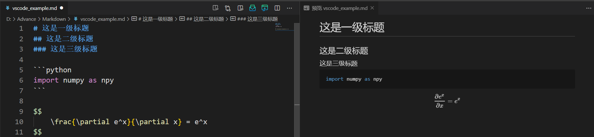
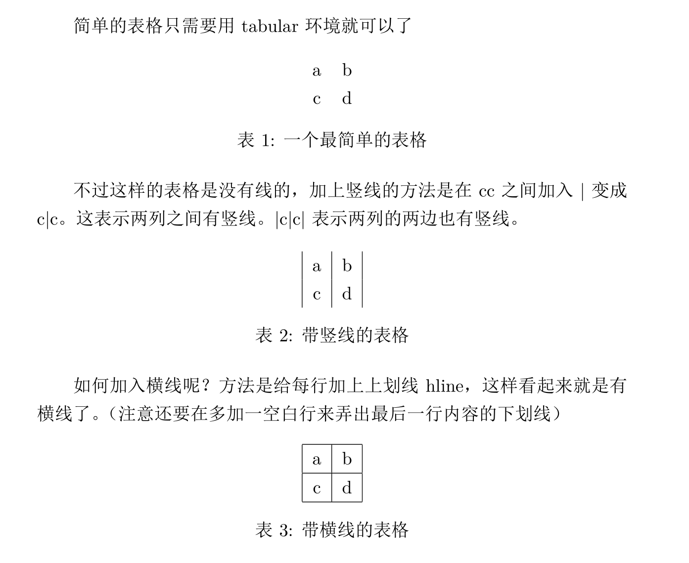

# Lecture 2: Code Editor & Documentation

本课程参考[MIT](https://web.mit.edu/)课程[The Missing Semester of Your CS Education](https://missing.csail.mit.edu/)，考虑到同学们之前上过课程的基础以及科研需要进行适当调整。

## Vim

[Vim](https://www.vim.org/)是一个历史悠久的、被广泛使用的、功能强大的文本编辑器，可以完全在命令行下运行，于是成为了服务器上编辑文本的首选，很多现代代码编辑器也支持Vim模式。同样出色的文本编辑器还有[Emacs](https://www.gnu.org/software/emacs/)，关于二者的比较可以看[这篇文章](https://www.diffen.com/difference/Emacs_vs_Vim)，二者的选择更多的是个人偏好，这里我们只关注Vim。另外，由于Vim年代久远维护困难，[Neovim](https://neovim.io/)应运而生，Neovim可以看作Vim的超集，同时移除了Vim一些不好的特性，这里我们也推荐大家使用更为现代的Neovim，但在我们所讲的范围内二者基本没有区别。

> Vim的学习曲线确实非常陡峭，想要熟练运用确实需要一定时间的练习，但是熟练掌握之后收获是巨大的。在初学阶段可以只依赖最简单的命令完成编辑，熟练之后再思考怎样更快地达到相同的目的。

### Vim哲学

在编程的时候，更多的时间是花在移动光标、阅读代码、修改代码，只有少部分时间花在了真正写代码上。出于这个原因，Vim提供了不同的模式：正常(Normal)、输入(Insert)、替换(Replace)、选择(Visual)、命令行(Command-line)，只有在输入模式下才能添加代码，其他模式用于编辑代码。Vim还是一个可编程的编辑器，可以重映射键盘，可以为快捷键指定命令，使得在Vim下可以不需要移动鼠标仅通过敲击键盘完成复杂的命令。Vim同时还有非常好的社区生态，提供了大量便捷的插件供选择，使得Vim在代码编辑上得以匹敌专业的IDE。下面我们从最基础的模式切换开始介绍Vim的各个特性。

### Vim模式

Vim可以在不同的模式之间切换，各个模式的功能可以直接从名字中看出来。


Normal模式是最基本的模式，在这个模式下基本只能移动光标，不能直接输入文本，因为此时键入任何字符都会被当成是Vim的命令而非插入到文本中。想要输入文本需要切换到Insert模式，可以直接键入`i`进入Insert模式，此时输入任何字符都会插入到光标所在位置。想从输入模式中返回Normal模式，只需要键入`<ESC>`。事实上，在任何模式下键入`<ESC>`都能回到Normal模式。Normal模式和Insert模式是Vim中最常用的两种模式，理论上我们只需要这两种模式就能完成修改文本的所有操作，其他模式和命令都是用来更快地完成一些任务。默认情况下，所处模式会显示在Vim窗口的左下角，Normal模式没有显示，Insert模式会显示`--INSERT--`，Command-line模式会显示所输入的命令等等。在Normal模式下键入`R`进入Replace模式，用于替换当前光标处的文本，键入`v`进入Visual模式，用于选择文本。

### 移动光标

Vim中所有键盘输入都可以视为命令，可以被记录下来映射到快捷键。在Normal模式下，最基本的命令是控制光标移动的命令`hjkl`，其中`jk`控制上下，`hl`控制左右，方向键同样可以控制光标，但是因为方向键盘离打字的范围比较远，所以推荐大家熟悉`hjkl`这四个键。在没有鼠标的情况下想实现长距离的光标跳转，每次只能移动一个单位显然是低效的，好在Vim为光标跳转提供了多种命令：

* 单词间：`w`可以跳转到下一个单词的开头，`b`跳转到当前单词的开头，继续按跳转到上一个单词的开头，`e`跳转到当前单词的结尾，继续按跳转到下一个单词的结尾
    > 遗憾的是中文很难分词，所以在中文中键入`w`会跳转到下一个短句
* 括号、引号间：如果光标在括号或者引号中间，`%`会高亮显示括号或引号，继续按会在头和尾反复横跳
* 行内：`0`跳转到行的开头，`^`跳转到行的第一个非空格的字符，`$`跳转到行的结尾
* 段落间：`{`跳转到上一段，`}`跳转到下一段
* 屏幕内：`H`跳转到屏幕最上面，`M`跳转到屏幕最中间，`L`跳转到屏幕最下面
* 屏幕滑动：`<C-u>`向上滑动，`<C-d>`向下滑动
* 文件内：`gg`跳转到文件开头，`G`跳转到文件结尾
* 其他：`zz`会将光标置于屏幕中心

这些基本命令可以和数字进行组合，输入任意数字（默认情况下显示在右下角），然后输入`j`就会向下移动对应行数，同理，如果是数字+`w`，就会移动对应单词数。另外，数字+`<CR>`等同于数字+`j`，数字+`G`会跳转到整个文件的第几行。  
除了这些直接跳转命令，Vim也提供了搜索机制。首先是行内的搜索，`f`、`t`、`F`、`T`后面加上任意字符x，代表跳转到当前光标下一个x、跳转到下一个x之前、跳转到上一个x、跳转到上一个x之后，搜索到了之后也可以继续按`,`和`;`在搜索结果之间前后移动。然后是文件内的搜索，直接键入`/`或者`?`会进入命令行搜索模式，`/`是从开头开始搜索，`?`是从结尾开始搜索，后面可以加上任意长度的字符，然后键入`<CR>`就可以高亮显示所有的搜索结果，按`n`和`N`就可以在搜索结果之间向前和向后移动。搜索模式支持正则表达式，关于正则表达式的详细内容我们之后再介绍。最后如果想要关闭搜索结果的高亮，需要借助命令行命令，输入`:noh`即可关闭高亮。

### 编辑

如之前所述，Vim最主要的编辑模式是Insert模式，想要修改文本，先将光标在Normal模式下移动到对应位置，然后再键入`i`进入Insert模式，在这个模式下添加或者删除文本。但是当我们需要修改的地方非常多时，每次都需要先移动光标再输入`i`就是一个相对麻烦的操作，因而Vim提供了一些命令将移动光标和进入Insert模式合成一步：

* `i`在当前位置输入（光标前），`I`在行首输入
* `a`在光标后输入(append)，`A`在行尾输入
* `o`在当前行下新建一行输入，`O`在当前行上新建一行输入
* `c`+光标移动命令会先删除然后进入Insert模式，比如`cl`会删除下一个字符，`cw`会删除到单词尾，`c10l`会删除10个字符。此外，`ciw`会删除整个单词，`cc`会删除整行，`ci(`(change in)会删除小括号里的内容，`ca(`(change around)则会删除小括号以及小括号里的内容，这在修改代码里的字符串、修改函数变量之类的工作中极其有用
* `s`(substitute)会删除当前字符并进入Insert模式，等同于`cl`

进入Insert模式之后，Vim也有一些奇奇怪怪的命令，比如`<C-h>`等同于删除键，会删除前一个字符，`<C-j>`等同于回车键，将光标后的文本移到下一行，但是否要这样做就全凭个人喜好了。  
其实在Normal模式下也能进行一些删除操作，`x`会删除当前字符，`d`+光标移动命令会删除对应文本，与`s`以及`c`命令的区别仅仅在于`x`和`d`操作完之后依然处在Normal模式，所以`s`也等同于`xi`。此外，`r`的作用也是替换当前字符，键入`r`之后会提示输入一个字符，输入完成之后自动回到Normal模式，想要替换长文本就需要键入`R`进入Replace模式。因此如果想要替换一个字符成x，最快的方法是`r`+x，也可以`s`+x+`<ESC>`，也可以`xi`+x+`<ESC>`，也可以`cl`+x+`<ESC>`。  
撤销和重做也是非常常用的编辑命令，在Vim中分别对应Normal模式下的`u`(undo)和`U`，同时`.`可以重复之前最后一个命令。

### 选择

编辑文本和代码难免要复制和粘贴，复制操作涉及到选择需要复制的文本，在Vim中这需要在Visual模式下进行。在Normal模式中键入`v`进入选择模式，可以跟在Normal模式下一样移动光标，被选择的文本就会高亮。或者在Normal模式中键入`V`进入行选择模式，被选择的行会高亮。选择完成后，如果直接按`<ESC>`就会返回Normal模式，并且选择的内容高亮消失，因此不应该这么做，而应该直接在Visual模式下键入`y`(yank)复制高亮的文本，如果输入的是`d`则会删除被选择的文本，此时会自动回到Normal模式。不管是`y`还是`d`操作，被选择的文本都会被操作到Vim的缓存中，在Normal模式下按`p`就会粘贴其中的文本到当前位置。与之前介绍的`cc`、`dd`类似，也可以直接在Normal模式下输入`yy`，对应复制当前行。  
Vim还提供了列选择模式，在Normal模式下键入`<C-V>`进入，选择完列之后可以跟Normal模式一样进行`r`、`d`等操作，这在制表、注释中非常有用。

### 命令行

我们上面介绍了Vim基本的编辑操作，编辑完成之后则需要保存并退出，这在Vim里需要在Command-line模式下完成。  
> 生成随机字符串的最好方法是让一个不会Vim的人尝试退出Vim

在Normal模式下键入`:`就会进入命令行模式，此时光标已经移动到了最下面。命令行中可以输入的命令种类非常多：

* `w`保存文件，但是不退出
* `w !sudo tee %`使用sudo保存文件
* `wq`、`x`、`ZZ`保存并退出
* `q!`、`ZQ`退出但不保存
* `!`+命令 可以在shell环境下执行命令
* `r !`+命令 可以在shell环境下执行命令并插入到当前光标下一行
* `e`+文件 可以加载新的文件（当前文件没保存的话会报错）
* `e!`+文件 加载新文件并丢弃当前更改
* `f`显示当前文件的文件名
* `%s/old/new/g`搜索所有`old`并替代成`new`，支持正则表达式

至此，我们已经介绍完成了所有Vim的基本功能。


### 扩展

Vim还有一些相对高级的功能这里没有详细介绍，比如使用[宏](https://vim.fandom.com/wiki/Macros)来记录命令，利用[重映射](https://vim.fandom.com/wiki/Mapping_keys_in_Vim_-_Tutorial_(Part_1))设置快捷键，使用[Snippets](https://github.com/SirVer/ultisnips)方便输入代码和公式，更有强大的[COC插件](https://github.com/neoclide/coc.nvim)（Neovim）使得Vim能像现代IDE一样编辑代码工程。这些功能往往需要组合Vim本身的机制和其他[第三方插件](https://vimawesome.com/)，保存在用户自定义的配置文件中。Vim的配置文件在`~/.vimrc`中，Neovim的在`.config/nvim/init.vim`中，之前我们也提到过Shell也有配置文件`.bashrc`，这一类的配置文件通称为dotfiles。github上有很多优秀作者将自己的dotfiles开源出来供大家学习参考，比如[thoughtbot](https://github.com/thoughtbot/dotfiles)，[skwp](https://github.com/skwp/dotfiles)，[nicknisi](https://github.com/nicknisi/dotfiles)，这些dotfiles是一个程序员代码习惯的直接反映，因此也有人说"You are your dotfiles"。  
但是无论Vim功能有多么强大，也只是一种工具，如果使用简单功能就能把事情完成得足够好，就没必要弄得花里胡哨，在这上面投入过多的时间是不明智的。dotfiles可以慢慢积累，更何况"You are not only your dotfiles"。

## VS Code

[VS Code](https://code.visualstudio.com/)已经成为现在最受欢迎的文本编辑器，与Vim一样，VS Code跨平台，有着活跃的社区提供丰富的插件，但在使用上比Vim更傻瓜。VS Code与[Visual Studio](https://visualstudio.microsoft.com/zh-hans/)可以说是除了都是一家公司出的之外毫无关系，VS Code是轻量的文本编辑器，不能直接编译运行代码，但是可以通过配置调用外部命令编译运行，VS则是功能强大的集成开发环境(IDE)，有编译、调试、性能分析等多种功能。

### VS Code总览

VS Code本质上浏览器。进入VS Code，顶栏help->about就会出现VS Code的版本信息
```
Version: 1.54.1 (user setup)
Commit: f30a9b73e8ffc278e71575118b6bf568f04587c8
Date: 2021-03-04T22:38:31.419Z
Electron: 11.3.0
Chrome: 87.0.4280.141
Node.js: 12.18.3
V8: 8.7.220.31-electron.0
OS: Windows_NT x64 10.0.18363
```
其中[Chrome](https://www.google.com/chrome/)是浏览器内核，[Node.js](https://nodejs.org/en/)是运行在[V8](https://v8.dev/)引擎上的[JavaScript](https://www.javascript.com/)环境，[Electron](https://www.electronjs.org/)是前端框架，所以本质上，在VS Code里写代码也就是在浏览器里写代码。在浏览器的基础上，VS Code的大部分功能通过插件(Extension)实现，包括对不同语言的支持。所有的Extension都可以在左边的Active Bar里的Extensions里搜索到，当使用VS Code打开一个文件或者文件夹时，VS Code也会推荐对应的插件。VS Code的设置也非常直接，可以通过左下角设置的UI界面设置，也可以通过`ctrl+shift+P`输入命令设置，也可以直接修改`settings.json`来修改设置。想要打开命令行，直接键入`ctrl+~`打开默认命令行。总的来说，VS Code是一个非常友好且功能强大的编辑器，因此这里不会过多介绍VS Code的具体使用，而是在之后碰到相关话题时介绍VS Code里的对应插件。

### VS Code Remote

由于我们之前已经提到了WSL，这里就介绍一下如何使用VS Code进行远程开发。VS Code官方（也就是微软）提供了三个插件：

* Remote-SSH: 用于SSH连接服务器
* Remote-WSL: 用于WSL
* Remote-Containers: 用于虚拟容器（后面介绍）

插件的用法也非常直接。对于SSH连接，安装插件之后先`ctrl-shift+P`进入command palette，首先选择`Remote-SSH: Connect to Host...`配置服务器，配置完成之后再选择`Remote-SSH: Connect to Host...`就可以连接服务器了。这时文件夹显示的是远程的文件夹，命令行是远程命令行，修改文件之后保存也会直接保存到远程服务器中。Remote-WSL的使用方法类似，这里不再赘述。

## Markdown

**Markdown**是一种极简的标记语言。其由`纯文本`和一些`特殊符号`组成。本部分会简单介绍**Markdown**的编辑器和语法，另外网上有一份好的交互式教程[markdown tutorial](https://www.markdowntutorial.com/zh-cn/)

***

### Markdown 简介

**Markdown** 于2004年被John Gruber提出，当时他给出的是一份`语法说明文档`和一个把遵循文档写出的代码转换成`html`的`脚本`。

在这之后，人们对其进行了各种各样的拓展，比如增加脚注，使用html以外的代码渲染等等。这导致了后续Markdown的语法各异，其标准化也被提上日程.2012年名为**Common Mark**的标准化工程启动了，后续许多网站都基于Common Mark实现自己的Markdown语法，比如**Github**于2017年公布了自己的GitHub Flavored Markdown（GFM）。

***

### 推荐的Markdown编辑器

Markdown代码的后缀名是`.md`，而从Markdown的发展来看，其编辑器大概有三种类型。

- **纯文本编辑器+手动调用渲染引擎**：简单来讲就是记事本...
- **左右分栏实时渲染**：一般左边编辑，右边给出实时渲染结果，或者是切换编辑/预览两种模式
- 编辑与实时渲染**统一在同一个窗口** 

第一种暂且不谈，第二种可以用vscode实现。



这里左侧是输入的markdown代码，右侧是实时渲染的结果，改变左侧代码会立刻反应在右侧。为了实现这个效果，我们只需要安装Markdown相关插件(推荐`Markdown All in One`和`Markdown Preview Enhanced`)。

另外一个比较推荐的编辑器是[Typora](https://typora.io/#)。其特点是编辑和实时渲染在同一个界面内。


平常情况下每个块显示成渲染后的结果，在对该块进行编辑时，其会展开成代码，并显示小的实时预览，比较适合非大屏使用。

> 使用typora记笔记建议 "文件->偏好设置->Markdown->Markdown拓展语法"，将内联公式，高亮等打开，或者进行其他自定义设置。

### Markdown的常用语法

#### 标题
本部分介绍一些`Markdown`的常用语法，其基本特点是用一些特殊符号去标记纯文本，使得纯文本用不同方式呈现。

对于刚接触Markdown的同学来说，Markdown最明显的语法应当是`header`。其通过在行首添加若干个`#`来标记各级标题。比如

```markdown=
# 这是一级标题
## 这是二级标题
### 这是三级标题

这是正文
```

会被显示成各级标题。


#### 黑体斜体

此外，还可以用`*`将文本标记为**黑体**和*斜体*。黑体需要在文字两侧各加**两个**`*`，斜体则是一个(用下划线也有一样的效果)。

#### 段落

当我们正文很长时，我们需要对其进行分段或者换行。对于一个**传统的**Markdown编辑器来讲，这并不是一个回车能解决的问题，比如下面的代码。

```markdown
我有自相矛盾么？
很好，那我是在自相矛盾了，
（我是庞大的，我承载着很多个自己。）
```

你得到的结果会是这三句话跑到了一行。这是因为单独的一个回车在Markdown编辑器看来，是你为了防止一行代码过长而做的操作，连续的两个回车才代表着开始下一个段落，即如下面的

```markdown
我有自相矛盾么？

很好，那我是在自相矛盾了，

（我是庞大的，我承载着很多个自己。）
```

这种连续两个回车(即多一个空行)的行为叫做`段落换行`，其渲染结果两行之间有很大的间隔。然而对于诗歌这种文体，其换行并不是换段，这样的大的间隔过于稀疏了，我们可以使用`段落间换行`，其间隔很小，实现方式是把`两个回车`换成`两个空格`。

> 但是现在的编辑器很多都不遵循这套了，单个回车就直接换行了。。。(甚至没找到两个回车才能换行的编辑器拿来做demo)

#### 列表

列表可能是用Markdown来做笔记最方便的功能，列表的标记是行首加一个`-`或者`*`，比如

```markdown
- 操作系统
- 计算机网络
- 编译原理
- 计算机组成与体系结构
```

会显示成

- 操作系统
- 计算机网络
- 编译原理
- 计算机组成与体系结构

列表中的每个项目都可以进行加粗，斜体等行为，就像其在正文一样。甚至可以更换段落，更换方式是执行换行操作后，在行首加空格(具体数目取决于编译器)，这样新的一行会和这个项目的缩进对齐。

```markdown
- 操作系统

 操作系统（operation system，简称OS）是**管理计算机硬件与软件资源的计算机程序**。
  
 操作系统需要处理如管理与配置内存、决定系统资源供需的优先次序
 
- 计算机网络
- 编译原理
- 计算机组成与*体系结构*
```

- 操作系统

 操作系统（operation system，简称OS）是**管理计算机硬件与软件资源的计算机程序**。
  
 操作系统需要处理如管理与配置内存、决定系统资源供需的优先次序
 
- 计算机网络
- 编译原理
- 计算机组成与*体系结构*

列表还可以拥有子列表，其语法与列表完全相同，但是子列表需要进行缩进。

```markdown
- 操作系统
    - 周八3.4节
    - 周一-1,-2节
```

- 操作系统
    - 周八3.4节
    - 周一-1,-2节

最后，编辑器一般还会对列表进行`待做/已完成`的拓展，方式是在`- `后面加上`[ ]`或者`[x]`(注意前者括号间有空格)。

```markdown
- [ ]工作
- [x]摸鱼
```

- [ ]工作
- [x]摸鱼

#### 引用，公式和代码块

有时我们引入了其他来源的内容，我们希望给它特别的格式，这时一般使用`>`进行标记。

```markdown
他曾经讲过

>苟利国家生死以  
>岂因祸福避趋之

>>不要见着风是得雨
```

他曾经讲过

>苟利国家生死以  
>岂因祸福避趋之

>>不要见着风是得雨

而Markdown一般也支持公式块，其标记为前后各一个`$$`，比如

```markdown
$$
\frac{a}{b} = c
$$
```

$$
\frac{a}{b} = c
$$

当然，这里的公式和`latex`一样，有特殊的描述方式，具体的方式可能放在`latex`讲。

如果你不想让公式单独占一行，而是想让其融入文字里，可以用前后各一个`$`包围公式，比如公式$e^x$就和这段文字融合起来了(typora需要打开内联公式的功能才能使用)。

也可以加入各种`块`，用单个“ \` ”包围文字，会让其`就像这样，像是单独开出一个块一样`。如果用三个“ \` ”，则会开出一个代码块，一般会在第一组\`\`\`后加语言名字以获得高亮。


#### 超链接，图片，锚

Markdown可以置入超链接，这让你在浏览渲染结果时，可以点击链接直接跳转，下面是一个例子

```markdown
欢迎大家点击[课程主页](http://vcl.pku.edu.cn/course/PFCII/index.html)
```

欢迎大家点击[课程主页](http://vcl.pku.edu.cn/course/PFCII/index.html)

`[]`里是该链接显示出的字，`()`里是链接的地址。

另外一种超链接基于锚点的机制。

```markdown
[点击此处，转到课程主页][main-page]

[main-page]:../index.html
```

[点击此处，转到课程主页][main-page]

[main-page]:../index.html

其中第二个`[]`里是参考链接，我们需要在后面手动定义这个链接是什么，可以是一个网页的超链接，可以是本文的某个标题，甚至是一个图片的编码，比如

```markdown
[点击此处，转到上一节标题][local-section]

[local-section]:#推荐的markdown编辑器
```

[点击此处，转到上一节标题][local-section]

[local-section]:#推荐的markdown编辑器

这种情况下不论第几级标题，一个`#`就可以了。


这个机制甚至可以用来插入图片。一般来讲，Markdown图片的插入语法是
```markdown=

图片标签可以不写，比如


还可以调整大小(注意空格)

```

如果你的图片在本地，但是你需要和别人共享文档，一般会找所谓的`图床`服务，它会为你上床的图片提供一个网页链接，从而可以使用网页图片链接。

另外一个暴力的方法就是把图片编码进md文件。这是因为图片往往还支持这样的语法

```markdown

```

`data:image/png;base64,iVBORw0......`是图片的base64编码。所以你可以将图片的base64编码放在文档最后，然后用锚点机制插入图片(使用此方法请注意和同学/同事的亲切友好关系)。

#### 目录，表格，分割线

很多Markdown都支持一键生成目录(知乎等网站除外)，方式是在插入目录的地方打入

```markdown
[toc]
```

另外还可以加入表格比如

```markdown
|命令|功能|命令|功能|
|:---:|:---:|:---:|:---:|
|date|显示时间|rm|删除|
|shutdown -h now|关闭系统|mv|移动、重命名|
|man|查看帮助文档|cp|复制|

```

|命令|功能|命令|功能|
|:---:|:---:|:---:|:---:|
|date|显示时间|rm|删除|
|shutdown -h now|关闭系统|mv|移动、重命名|
|man|查看帮助文档|cp|复制|

还可以使用`***`打出分割线。

***

更多语法依赖于特定的渲染器，大家可以自行挖掘。

## LaTeX

上过离散/机器学习的各位想必对Latex都不陌生，它是一种高效，高质量的排版系统，简单来讲，`c++`的代码编译结果是`exe`，`markdown`的“编译结果”是`html`，`latex`的编译结果就是`pdf`。

对于日常科研，`Latex`是不可或缺的，大多数论文都需要使用Latex排版，而且记录自己推导的式子和想法时，Latex也是一个非常棒的工具。

本部分我们简单介绍下`Latex`的配置和基本语法，以及一些常用的trick。

### Latex的配置

最常见的Latex编写环境是`Overleaf`，它是一个在线共享编辑的网站，登陆后，你创建Latex项目，并在项目内编辑Latex代码，远程编译成pdf并下载，并且可以多人协作。


Overleaf的另一个好处是有大量的模板可供使用。如果你是会员的话，还可以和`git`搭配使用，并且邀请更多的合作者。当然，需要注意，一般大的会议论文提交前期Overleaf的压力很大，很可能崩掉，因此最好错峰做好本地备份。而且有时候需要`魔法`才能登陆。

另外我们再介绍下Latex的本地配置方案。

首先安装[Tex Live](http://www.tug.org/texlive/)，这会让你的电脑能够编译tex文件。之后我们需要配置VsCode使其能舒适地编写Latex。

首先需要配置tex的编译命令，可以参考[网上其他的教程](https://zhuanlan.zhihu.com/p/71432461)配置后，你可以使用build或者单纯的ctrl+s进行编译。此时的预览会是左右分栏的。如果你希望分屏，可以使用外置的viewer，这让你可以在一个大屏幕内进行编写，另外一个屏幕进行预览。

>外置viewer配置方式是在用户设置里，将Latex-workshop>View>Pdf:Viewer 设置成external，然后将Latex-workshop>View>Pdf>External>Viewer:Command设置成viewer的exe位置

latexwork shop还会提供一些额外的支持，安装插件后，打开一个tex文件，左侧会新增一个TEX的选项，打开后会有一些帮助项。


本地配置的好处是不需要联网，但是坏处是需要自己管理各个tex项目的位置和下载模板。并且在编译时可能需要自己选择编译命令(如`pdflatex->biber->pdflatex->pdflatex`)

### Latex基本例子

本部分只简单介绍Latex的基本语法，对Latex有一定了解的同学可以略过。

程序员们学习一门新语言的最好方法无外乎直接读该语言的代码。下面是一个Latex的简单例子。

```latex
\documentclass{article}

%---------------------%
% 这是导言区
%---------------------%

\begin{document}
    % 这是正文
    This is my first document.

    Happy \LaTeX ing!
\end{document}
```


不难看出，第一行为声明本文档的类型为`article`。`%`则是Latex的注释符号，`\begin{document}`和`\end{document}`之间的则是文档的正文。

其中`\begin{document}`之前的区域称为导言区，其并不被渲染，是为了后面的书写做准备。导言区可以有的内容比如使用`\usepackage{xxx}`导入包，用`\author{xxx}`命令声明作者，用`\newcommand`定义新的命令等等。

需要注意的是，Latex本身设计时是面向英文的，如果想要使用中文，请把文档类型从`article`改为`ctexart`。

### Latex常用语法

#### 章节
```latex
\documentclass{ctexart}

    \title{前沿计算研究与实践II}
    \author{姚贺源}
    \date{\today}

\begin{document}

    \maketitle

    \section{前沿计算研究总述}
    \subsection{简介}


\end{document}

```


在这个例子里我们在导言区定义了`titile`的各个属性，并在正文的开头使用了`\maketitle`命令，这产生了渲染结果的前三行(标题，作者，日期)。

之后我们用`\section`命令产生了一级标题，后面的文字就是标题的内容。如果想产生子标题则是`\subsection`，并还有`\subsubsection`可以使用。

#### 列表

Latex同样有列表环境，具体的使用方式是

```latex

% 以圆点开头的列表
\begin{itemize}
    \item 条目1
    \item 条目2
\end{itemize}

% 以数字开头的列表

\begin{enumerate}
    \item 条目1
    \item 条目2
\end{enumerate}

```


Latex的列表同样可以嵌套，并且可以自己指定编码样式，可以查看[更多Latex列表操作](https://linux.cn/article-13112-1.html)

#### 插入公式

latex有自己独特的数学公式描述方式。首先，为了表明这段内容是一段公式，我们需要将其写在公式环境里

```latex
\begin{equation}
1+1=2
\end{equation}
```

$$
1+1=2
$$

当然，如果你想在行内写公式的话，和Markdown一样，只需要在行内用`$`将公式包围即可。

并不是所有的字母都能通过键盘直接输入，比如$\alpha$，它们有自己的代号，比如$\alpha$写作`\alpha`，$\beta$写作`\beta`。具体的符号表参见[Markdown符号表](https://www.zybuluo.com/codeep/note/163962)和[Latex符号表](https://www.overleaf.com/latex/templates/symbol-table/fhqmttqvrnhk)。

当然，公式并不只有简单的从左到右的符号堆积，其往往还有一定的层次结构，比如上下角标，分式，甚至是矩阵。Latex基本的描述方式是从左到右，从大到小。比如$e^x$ 的主体是`e`，$x$是其上角标(用`^`表示)，故而写作`e^x`。而下角标用`_`表示。故而

```markdown
y_i = e^x
```

就是$y_i = e^x$。然而需要注意，`^`默认只结合后面一个字母，如果上/下角标不止一个字母，则需要用`{}`包围起来。比如$e^{x_i}$写作`e^{x_i}`。分式的主体则是分式本身，分子和分母都是它的两个参数，比如$\frac{a}{b}$写作`\frac{a}{b}`，其中`frac`是分数`fraction`的缩写。

下面是一个复杂的公式

```latex
$$
\rho \frac{dV}{dt} = pg - \nabla p + \mu \nabla^2 V
$$
```

$$
\rho \frac{dV}{dt} = pg - \nabla p + \mu \nabla^2 V
$$


我们再提一些重要细节。

- 首先 $\varepsilon$ 确实读作 `\epsilon`，但是其写作 `\varepsilon`。单纯的 `\epsilon`会变成 $\epsilon$。
    - 同理还有 $\varphi$ 和 $\phi$，分别是 `\varphi` 和 `\phi`
- Latex公式默认斜体，如果有时需要写文本，需要用`\text{}`或`\mathrm{}`
    - $\mathrm{m a t h r m}$会吃掉你的空格，但是$\text{t e x t}$不会。
    - 当然可以在$\mathrm{m~a~t~h~r~m}$里和正常公式环境一样用波浪线代表空格
- 花体字母一般使用`\mathcal{}`，比如$\mathcal{ABC}$。
    - 但是注意区分$\chi$和$\mathcal{X}$，前者写作`\chi`，后者才是花体X
- 如果需要使用多行公式，可以把`equation`环境换成`align`环境，每行公式以`\\`结尾
    - 需要在导言区引入包`\usepackage{amsmath}`
    - 此时还可以用`&`指定对齐位置，每行的`&`会对到一起。
     比如下面式子会把等号对齐
     ```latex
     \rho \frac{dV}{dt} &= pg - \nabla p + \mu \nabla^2 V \\
     1+1 &= 2
     ```
- Latex默认给公式标号，如果不想要标号可以把`equation`换成`equation*`，其余自动标号的环境同理


#### 插入图片和表格

图片的插入语法为

```latex
\includegraphics[parameter]{picturename.jpg}
```

其中parameter指定图片呈现的参数，一般是大小，比如

```latex
\includegraphics[width = 0.7\textwidth]{figure/dragon.jpg}
```

表示插入`figure`文件夹下的`dragon.jpg`，大小为当前文档文本宽度的0.7倍。

> jpg格式其实不能直接插入，需要`\usepackage{graphicx}`

一般情况下我们很少会把图片直接插入到我们的文本当中，而是会给它放置在一个叫做浮动体的东西中。这样图片可以有一些相对位置的变换，不会造成分页困难等问题。[复制自MOON论坛](https://www.moonpapers.com/blog/5f7ce3cb30a4195e92392776)

常用的格式如下

```latex
\begin{figure}[htb]
        \centering % 表示居中
        \includegraphics[width = 0.7\textwidth]{figure/dragon.jpg}
        \caption{肥宅龙} % 图片会呈现的标题
        \label{fig:dragon}
\end{figure}
```

这里`figure`就是浮动环境，Latex会基于自己的美学概念把它放到合适的位置，`[]`内是对Latex的**建议**

- h:here
- t:top
- b:bottom
- p:page of float

Latex按你的先后顺序尝试这些规则，如果不满足它还是会自己搞自己的，故而这样使用时尽量避免使用`下面这幅图`这样的依赖于位置的话语。

> 如果你非要坚持自己的想法的话，可以用`[!hbt]`向Latex表达你坚定的决心。但是如果Latex还是不理你，你可以`\usepackage{float}`，然后`[H]`，这样就会放在此处，代价是可能导致大片空白。

如果要指定图片的话，`引用`是一个不错的替代。因为在figure里我们定义了`label{fig:dragon}`，我们可以使用`\ref{{fig:dragon}}`来获得图片的标号。

比如

```latex
图片(\ref{fig:dragon})真可爱。
```

会变成`图片 (1) 真可爱。`，其中`1`就是图片此时的编号。

> 不过如果你直接编译的话，大概率获得`图片 (??) 真可爱`。这是因为第一次从前往后遍历时候Latex无法解析此处的引用。它会把等着填的引用放入`.aux`文件里。再编译一次就会恢复正常了。
> 如果你编译两次还是不正常，检查下你的编辑器是否自动删除了`aux`文件


表格的语法就比较复杂。 简单的表格只需要用tabular环境就可以了

```latex
\begin{table}[htb] % 表格外层的环境，没什么用
    \centering % 表示后面的居中
    \begin{tabular}{cc} 

    % {}中的字母数代表表格的栏数
    % cc表示都居中，cl表示第一栏居中，第二栏左对齐，类似的还有cr

    a  & b \\ % \\ 换行， & 表示一列结束开始下一列
    c  & d

    \end{tabular}
    \caption{一个最简单的表格}
    \label{tab:my_label}
\end{table}
```

不过这样的表格是没有线的，加上竖线的方法是在cc之间加入|变成c|c。这表示两列之间有竖线。|c|c|表示两列的两边也有竖线。
 ```latex
\begin{table}[htb] 
    \centering % 表示后面的居中
    \begin{tabular}{|c|c|} 

    a  & b \\ 
    c  & d
    \end{tabular}
    \caption{带竖线的表格}
    \label{tab:my_label}
\end{table}
```

如何加入横线呢？方法是给每行加上上划线hline，这样看起来就是有横线了。（注意还要在多加一空白行来弄出最后一行内容的下划线）

```latex
\begin{table}[H] 
    \centering % 表示后面的居中
    \begin{tabular}{|c|c|} 
    \hline
    a  & b \\ 
    \hline
    c  & d \\
    \hline
    \end{tabular}
    \caption{带横线的表格}
    \label{tab:my_label}
\end{table}
```




不过有时候我们需要打很大的表格，这样打肯定没有excel方便，我们可以用工具把excel转成latex，一个有用的工具是[excel2latex](https://www.ctan.org/tex-archive/support/excel2latex)(细节可以自行百度)。


#### 论文引用

论文引用一般使用`bibtex`。

其使用方式包含以下几点：

- 把所有的文件导出成`bibtex`格式，并放入一个`.bib`文件，比如`example.bib`
    - 其内的每一条对应一个文献的简称，标题，作者，出版年份等信息
     ```latex
     @article{einstein,
    author =       "Albert Einstein",
    title =        "{Zur Elektrodynamik bewegter K{\"o}rper}. ({German})
    [{On} the electrodynamics of moving bodies]",
    journal =      "Annalen der Physik",
    volume =       "322",
    number =       "10",
    pages =        "891--921",
    year =         "1905",
    DOI =          "http://dx.doi.org/10.1002/andp.19053221004",
    }
     ```
- 在正文里做三件事
    - 用`\bibliographystyle{}`指定引用的风格
    - 在需要引用的地方，输入`cite{einstein}`
    - 在文章末尾指定使用的`bib`文件，命令是`\bibliography{example}`
        - 这会在末尾生成参考文献列表
        - 这只会显示出被`cite`的文章，如果有文章没被`cite`但是你想显示，需要在这之前`notice{xxx}`，假装引用它
        - 如果`bib`里所有文件都需要显示，可以直接`notice{*}`

- 编译时，需要编译四次，分别是`xelatex->bibtex->xelatex->xelatex`
    - 可以配置自动完成
    - 


## 工具组合

我们已经介绍了两种最常用的编辑器Vim和VS Code，以及两种文本语言Markdown和Latex，这对于我们日常的文档需求已经非常足够了，比如上课做笔记的时候使用Markdown，在写正式文档或者论文时使用Latex。使用Vim+LaTeX可以达到令人惊讶的高效率和高质量，比如Gilles Castel展示的他[如何在数学课上使用LaTeX和Vim记笔记](https://castel.dev/post/lecture-notes-1/)。  
值得一提的是Markdown作为为Web而生的轻量语言，可以轻松被转换成为html，例如本网站就全部使用Markdown编写。在VS Code下，[Markdown插件](https://github.com/yzhang-gh/vscode-markdown)可以将Markdown转换为html和pdf等格式，一些静态网站架构比如[jekyll](http://jekyllcn.com/)能够在线完成这一功能，在本地则可使用强大的[pandoc](https://pandoc.org/)工具完成这一工作
```bash
pandoc demo.md -o demo.html
```
本网站使用的正是pandoc，生成的脚本文件如下
```bash
echo generate index.html
pandoc -s index.md -o index.html --template ./template/uikit.html  --toc --toc-depth 2
mkdir -p html-gen
cd md-source
for file in $(ls)
do
    echo generate ${file%.*}.html
    pandoc -s $file -o ../html-gen/${file%.*}.html --template ../template/uikit.html --toc --toc-depth 2 \
    --highlight-style ../my.theme --syntax-definition ../syn.xml --mathjax
done
```
大家也可以通过这个例子看到我们是如何将之前介绍的工具整合在一起的。事实上pandoc能够完成的格式转换是非常多的，常用的输入格式有`markdown`、`ipynb`、`html`等等，输出则可以是`html`、`docx`、`latex`等等，同时每种转换都可以自定义模板。这意味着我们可以先用markdown打一个草稿，然后转换成docx调整格式，最后输出pdf。对于幻灯片制作也可以采取类似的思路，从markdown开始到pptx，或者到latex的beamer，甚至可以利用前端插件比如[revealjs](https://revealjs.com/)将幻灯片挂到网站上动态展示，比如[这个例子](http://www.lwruan.com/_slides/mgpcg.html#/title-slide)。


## Reference

* [Emacs vs. Vim](https://www.diffen.com/difference/Emacs_vs_Vim)
* [Vim Cheat Sheet](https://vim.rtorr.com/)
* [Markdown Tutorial](https://www.markdowntutorial.com/zh-cn/)
* [Learn LaTeX in 30 minutes](https://www.overleaf.com/learn/latex/Learn_LaTeX_in_30_minutes)
* [Markdown符号表](https://www.zybuluo.com/codeep/note/163962)
* [Latex符号表](https://www.overleaf.com/latex/templates/symbol-table/fhqmttqvrnhk)
* [The Comprehensive LATEX Symbol List](http://mirrors.ustc.edu.cn/CTAN/info/symbols/comprehensive/symbols-a4.pdf)
