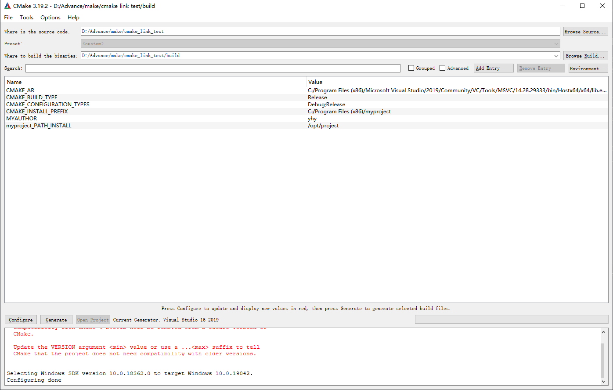
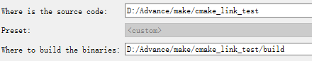

# Lecture 5: Python+Cpp & Build System


Python写起来非常方便, 但面对大量for循环的时候, 执行速度有些捉急. 原因在于, python是一种动态类型语言, 在运行期间才去做数据类型检查, 这样效率就很低(尤其是大规模for循环的时候).

相比而言, C/C++每个变量的类型都是事先给定的, 通过编译生成二进制可执行文件. 相比与python, C/C++效率比较高, 大规模for循环执行速度很快. 

既然python的短板在于速度, 所以, 为了给python加速, 能否在Python中调用C/C++的代码? 

### Python解释器

当我们编写Python代码时，我们得到的是一个包含Python代码的以`.py`为扩展名的文本文件。要运行代码，就需要Python解释器去执行`.py`文件。

(你给我翻译翻译, 什么叫python代码)

#### CPython

当我们从[Python官方网站](https://www.python.org/)下载并安装好Python后，我们就直接获得了一个官方版本的解释器：`CPython`。这个解释器是用C语言开发的，所以叫`CPython`。在命令行下运行`python`就是启动`CPython`解释器。`CPython`是使用最广的Python解释器。

虽然CPython效率低, 但是如果用它去调用C/C++代码, 效果还是挺好的. 像numpy之类的数学运算库, 很多都是用C/C++写的. 这样既能利用python简洁的语法, 又能利用C/C++高效的执行速度, (赢了两次, 赢麻了). 有些情况下numpy效率比自己写C/C++还高, 因为numpy利用了CPU指令集优化和多核并行计算(又赢了两次).

我们今天要讲的Python调用C/C++, 都是基于CPython解释器的.

#### IronPython

`IronPython`和`Jython`类似，只不过`IronPython`是运行在微软`.Net`平台上的`Python`解释器，可以直接把Python代码编译成.Net的字节码。缺点在于, 因为`numpy`等常用的库都是用`C/C++`编译的, 所以在`IronPython`中调用`numpy`等第三方库非常不方便.

#### Jython

`Jython`是运行在`Java`平台上的`Python`解释器，可以直接把`Python`代码编译成`Java`字节码执行。`Jython`的好处在于能够调用`Java`相关的库, 坏处跟`IronPython`一样.

#### PyPy

PyPy一个基于Python的解释器，也就是用python解释.py. 它的目标是执行速度。PyPy采用[JIT技术](http://en.wikipedia.org/wiki/Just-in-time_compilation)，对Python代码进行动态编译（注意不是解释），所以可以显著提高Python代码的执行速度。

### 为什么动态解释慢

假设我们有一个简单的python函数

```python
def add(x, y):
	return x + y
```

然后`CPython`执行起来大概是这个样子(伪代码)

```c
if instance_has_method(x, '__add__') {
    // x.__add__ 里面又有一大堆针对不同类型的 y 的判断
    return call(x, '__add__', y);
} else if isinstance_has_method(super_class(x), '__add__' {
    return call(super_class, '__add__', y);
} else if isinstance(x, str) and isinstance(y, str) {
    return concat_str(x, y);
} else if isinstance(x, float) and isinstance(y, float) {
    return add_float(x, y);
} else if isinstance(x, int) and isinstance(y, int) {
    return add_int(x, y);
} else ...
```

因为Python的动态类型, 一个简单的函数, 要做很多次类型判断. 这还没完，你以为里面把两个整数相加的函数，就是 C 语言里面的 x + y 么? No.

Python里万物皆为对象, 实际上Python里的int大概是这样一个结构体(伪代码).

```c
struct {
    prev_gc_obj *obj
    next_gc_obj *obj
    type IntType
    value IntValue
    ... other fields
}
```

每个 int 都是这样的结构体，还是动态分配出来放在 heap 上的，里面的 value 还不能变，也就是说你算 1000 这个结构体加 1000 这个结构体，需要在heap里malloc出来 2000 这个结构体. 计算结果用完以后, 还要进行内存回收. (执行这么多操作, 速度肯定不行)

所以, 如果能够静态编译执行+指定变量的类型, 将大幅提升执行速度.

## cython

### 什么是cython

cython是一种新的编程语言, 它的语法基于python, 但是融入了一些C/C++的语法. 比如说, cython里可以指定变量类型, 或是使用一些C++里的stl库(比如使用`std::vector`), 或是调用你自己写的C/C++函数.

注意: Cython不是CPython!

### 原生Python

我们有一个`RawPython.py`

```python
from math import sqrt
import time

def func(n):
    res = 0
    for i in range(1, n):
        res = res + 1.0 / sqrt(i)
    return res

def main():
    start = time.time()
    res = func(30000000)
    print(f"res = {res}, use time {time.time() - start:.5}")

if __name__ == '__main__':
    main()
```

我们先使用Python原生方式来执行看一下需要多少时间。


### 编译运行Cython程序

首先, 把一个cython程序转化成`.c/.cpp`文件, 然后用`C/C++`编译器, 编译生成二进制文件. 在Windows下, 我们需要安装Visual Studio/mingw等编译工具. 在Linux或是Mac下, 我们需要安装`gcc`, `clang` 等编译工具.

1. 通过`pip`安装cython

   ```shell
   pip install cython
   ```

   

2. 把`RawPython.py`重命名为`RawPython1.pyx`

3. (1)用setup.py编译

   增加一个`setup.py`, 添加以下内容. 这里language_level的意思是, 使用Python 3.

   ```python
   from distutils.core import setup
   from Cython.Build import cythonize
   
   setup(
       ext_modules = cythonize('RawPython1.pyx', language_level=3)
   )
   ```

   把Python编译为二进制代码

   ```shell
   python setup.py build_ext --inplace
   ```

   然后, 我们发现当前目录下多了RawPython1.c(由`.pyx`转化生成), 和`RawPython1.pyd`(由.c编译生成的二进制文件). 

   (2)直接在命令行编译(以`gcc`为例)

   ```shell
   cython RawPython1.pyx
   gcc -shared -pthread -fPIC -fwrapv -O2 -Wall -fno-strict-aliasing -I/usr/include/python3.x -o RawPython1.so RawPython1.c
   ```

   第一句是把.pyx转化成.c, 第二句是用`gcc`编译+链接.

4. 在当前目录下, 运行

   ```shell
   python -c "import RawPython1; RawPython1.main()"
   ```

   我们可以导入编译好的RawPython1模块, 然后在Python中调用执行.

   

由以上的步骤的执行结果来看，并没有提高太多，只大概提高了一倍的速度，这是因为Python的运行速度慢除了因为是解释执行以外还有一个最重要的原因是Python是动态类型语言，每个变量在运行前是不知道类型是什么的，所以即便编译为二进制代码同样速度不会太快，这时候我们需要深度使用`Cython`来给Python提速了，就是使用`Cython`来指定Python的数据类型。

### 加速!加速!

#### 指定变量类型

cython的好处是, 可以像C语言一样, 显式地给变量指定类型. 所以, 我们在`cython`的函数中, 加入循环变量的类型. 

然后, 用C语言中的sqrt实现开方操作. 

```cython
def func(int n):
    cdef double res = 0
    cdef int i, num = n
    for i in range(1, num):
        res = res + 1.0 / sqrt(i)
    return res
```

但是, python中`math.sqrt`方法, 返回值是一个`Python`的`float`对象, 这样效率还是比较低.

为了, 我们能否使用C语言的sqrt函数? 当然可以~

`Cython`对一些常用的C函数/C++类做了包装, 可以直接在Cython里进行调用.

我们把开头的

```python
from math import sqrt
```

换成

```cython
from libc.math cimport sqrt
```

再按照上面的方式编译运行, 发现速度提高了不少.


#### Cython调用C/C++

既然C/C++比较高效, 我们能否直接用cython调用C/C++呢? 就是用C语言重写一遍这个函数, 然后在cython里进行调用.

首先写一段对应的C语言版本

usefunc.h

```c
#pragma once
#include <math.h>
double c_func(int n)
{
	int i;
	double result = 0.0;
	for(i=1; i<n; i++)
		result = result + sqrt(i);
	return result;
}
```

然后, 我们在`Cython`中, 引入这个头文件, 然后调用这个函数

```cython
cdef extern from "usecfunc.h":
    cdef double c_func(int n)
import time

def func(int n):
    return c_func(n)

def main():
    start = time.time()
    res = func(30000000)
    print(f"res = {res}, use time {time.time() - start:.5}")
```

#### 在Cython中使用numpy

在`Cython`中, 我们可以调用`numpy`. 但是, 如果直接按照数组下标访问, 我们还需要动态判断`numpy`数据的类型, 这样效率就比较低. 

```cython
import numpy as np
cimport numpy as np
from libc.math cimport sqrt
import time

def func(int n):
    cdef np.ndarray arr = np.empty(n, dtype=np.float64)
    cdef int i, num = n 
    for i in range(1, num):
        arr[i] = 1.0 / sqrt(i)
    return arr

def main():
    start = time.time()
    res = func(30000000)
    print(f"len(res) = {len(res)}, use time {time.time() - start:.5}")
```

解释:

```cython
cimport numpy as np
```

这一句的意思是, 我们可以使用`numpy`的C/C++接口(指定数据类型, 数组维度等).


```cython
import numpy as np
```

这一句的意思是, 我们也可以使用`numpy`的Python接口(np.array, np.linspace等). `Cython`在内部处理这种模糊性，这样用户就不需要使用不同的名称.


在编译的时候, 我们还需要修改setup.py, 引入`numpy`的头文件.

```python
from distutils.core import setup, Extension
from Cython.Build import cythonize
import numpy as np

setup(ext_modules = cythonize(
    Extension("RawPython4", ["RawPython4.pyx"],include_dirs=[np.get_include()],), 
    language_level=3)
)
```


##### 加速!加速!

上面的代码, 还是能够进一步加速的

1. 可以指定`numpy`数组的数据类型和维度, 这样就不用动态判断数据类型了. 实际生成的代码, 就是按C语言里按照数组下标来访问.

2. 在使用numpy数组时, 还要同时做数组越界检查. 如果我们确定自己的程序不会越界, 可以关闭数组越界检测.

3. Python还支持负数下标访问, 也就是从后往前的第`i`个. 为了做负数下标访问, 也需要一个额外的if..else..来判断. 如果我们用不到这个功能, 也可以关掉.

4. Python还会做除以0的检查, 我们并不会做除以0的事情, 关掉.

5. 相关的检查也关掉.


最终加速的程序如下:

```cython
import numpy as np
cimport numpy as np
from libc.math cimport sqrt
import time
cimport cython

@cython.boundscheck(False)         # 关闭数组下标越界
@cython.wraparound(False)          # 关闭负索引
@cython.cdivision(True)            # 关闭除0检查
@cython.initializedcheck(False)    # 关闭检查内存视图是否初始化
def func(int n):
    cdef np.ndarray[np.float64_t, ndim=1] arr = np.empty(n, dtype=np.float64)
    cdef int i, num = n 
    for i in range(1, num):
        arr[i] = 1.0 / sqrt(i)
    return arr

def main():
    start = time.time()
    res = func(30000000)
    print(f"len(res) = {len(res)}, use time {time.time() - start:.5}")
```


```cython
cdef np.ndarray[np.float64_t, ndim=1] arr = np.empty(n, dtype=np.float64)
```

这一句的意思是, 我们创建numpy数组时, 手动指定变量类型和数组维度.


上面是对这一个函数关闭数组下标越界, 负索引, 除0检查, 内存视图是否初始化等. 我们也可以在全局范围内设置, 即在.pyx文件的头部, 加上注释

```cython
# cython: boundscheck=False
# cython: wraparound=False
# cython: cdivision=True
# cython: initializedcheck=False
```


也可以用这种写法:

```cython
with cython.cdivision(True):
	# do something here
```


#### 其他

cython吸收了很多C/C++的语法, 也包括指针和引用. 也可以把一个struct/class从C++传给Cython. 

#### 总结

Cython的语法与Python类似, 同时引入了一些C/C++的特性, 比如指定变量类型等. 同时, Cython还可以调用C/C++的函数. 

Cython的特点在于, 如果没有指定变量类型, 执行效率跟Python差不多. 指定好类型后, 执行效率才会比较高.

更多文档可以参考Cython官方文档 http://docs.cython.org/en/latest/index.html

## pybind11

`Cython`是一种类`Python`的语言, 但是`pybind11`是基于`C++`的. 我们在.cpp文件中引入pybind11, 定义python程序入口, 然后编译执行就好了.

从官网的说明中看到pybind11的几个特点

- 轻量级头文件库
- 目标和语法类似于优秀的Boost.python库
- 用于为python绑定c++代码

#### 安装

可以执行`pip install pybind11`安装 pybind11 (万能的pip)

也可以用Visual Studio + vcpkg+CMake来安装(yhy之后会讲).

#### 简单的例子

```C++
#include <pybind11/pybind11.h>

namespace py = pybind11;
int add_func(int i, int j) {
    return i + j;
}

PYBIND11_MODULE(example, m) {
    m.doc() = "pybind11 example plugin";  //可选，说明这个模块是做什么的
    m.def("add_func", &add_func, "A function which adds two numbers");
}
```

首先引入pybind11的头文件, 然后用PYBIND11_MODULE声明.

- example：模型名，切记不需要引号. 之后可以在python中执行`import example`

- m：可以理解成模块对象, 用于给Python提供接口

- m.doc()：help说明

- m.def：用来注册函数和Python打通界限

```c++
m.def( "给python调用方法名"， &实际操作的函数， "函数功能说明" ). //其中函数功能说明为可选
```


#### 编译&运行

pybind11只有头文件，所以只要在代码中增加相应的头文件, 就可以使用pybind11了.

```c++
#include <pybind11/pybind11.h>
```


1. 在Linux下, 可以执行这样的命令来编译:

```shell
 c++ -O3 -Wall -shared -std=c++11 -fPIC $(python3 -m pybind11 --includes) example.cpp -o example$(python3-config --extension-suffix)
```

2. 我们也可以用setup.py来编译(在Windows下, 需要Visual Studio或mingw等编译工具; 在Linux或是Mac下, 需要gcc或clang等编译工具)

```python
from setuptools import setup, Extension
import pybind11

functions_module = Extension(
    name='example',
    sources=['example.cpp'],
    include_dirs=[pybind11.get_include()],
)

setup(ext_modules=[functions_module])
```

然后运行下面的命令, 就可以编译了

```shell
python setup.py build_ext --inplace
```

在python中进行调用

```shell
python -c "import example; print(example.add_func(200, 33))"
```

#### 在pybind11中指定函数参数

通过简单的代码修改，就可以通知Python参数名称

```c++
m.def("add", &add, "A function which adds two numbers",
      py::arg("i"), py::arg("j"));
```

也可以指定默认参数

```c++
int add(int i = 1, int j = 2) {
    return i + j;
}
```

在`PYBIND11_MODULE`中指定默认参数

```c++
m.def("add", &add, "A function which adds two numbers",
      py::arg("i") = 1, py::arg("j") = 2);
```

#### 为Python方法添加变量

```c++
PYBIND11_MODULE(example, m) {
    m.attr("the_answer") = 23333;
    py::object world = py::cast("World");
    m.attr("what") = world;
}
```

对于字符串, 需要用`py::cast`将其转化为Python对象.

然后在Python中, 可以访问`the_answer`和`what`对象

```python
import example
>>>example.the_answer
42
>>>example.what
'World'
```


#### 在cpp文件中调用python方法

因为python万物皆为对象, 因此我们可以用`py::object` 来保存Python中的变量/方法/模块等.

```c++
py::object os = py::module_::import("os");
py::object makedirs = os.attr("makedirs");
makedirs("/tmp/path/to/somewhere");
```

这就相当于在Python里执行了

```python
import os
makedirs = os.makedirs
makedirs("/tmp/path/to/somewhere")
```


#### 用pybind11使用python list

我们可以直接传入python的list

```c++
void print_list(py::list my_list) {
   for (auto item : my_list)
       py::print(item);
}

PYBIND11_MODULE(example, m) {
    m.def("print_list", &print_list, "function to print list", py::arg("my_list"));
}
```

在Python里跑一下这个程序, 

```python
>>>import example
>>>result = example.print_list([2, 23, 233])
2 
23 
233
>>>print(result)

```

这个函数也可以用`std::vector<int>`作为参数. 为什么可以这样做呢? pybind11可以自动将python list对象, 复制构造为`std::vector<int>`. 在返回的时候, 又自动地把`std::vector`转化为Python中的list. 代码如下:

```c++
#include <pybind11/pybind11.h>
#include <pybind11/stl.h>
std::vector<int> print_list2(std::vector<int> & my_list) {
    auto x = std::vector<int>();
    for (auto item : my_list){
        x.push_back(item + 233);
    }
    return x;
}

PYBIND11_MODULE(example, m) {
    m.def("print_list2", &print_list2, "help message", py::args("my_list"));
}
```


#### 用pybind11使用numpy

因为numpy比较好用, 所以如果能够把numpy数组作为参数传给pybind11, 那就非常香了. 代码如下(一大段)

```c++
#include <pybind11/pybind11.h>
#include <pybind11/numpy.h>

py::array_t<double> add_arrays(py::array_t<double> input1, py::array_t<double> input2) {
    py::buffer_info buf1 = input1.request(), buf2 = input2.request();

    if (buf1.ndim != 1 || buf2.ndim != 1)
        throw std::runtime_error("Number of dimensions must be one");

    if (buf1.size != buf2.size)
        throw std::runtime_error("Input shapes must match");

    /* No pointer is passed, so NumPy will allocate the buffer */
    auto result = py::array_t<double>(buf1.size);

    py::buffer_info buf3 = result.request();

    double *ptr1 = (double *) buf1.ptr,
           *ptr2 = (double *) buf2.ptr,
           *ptr3 = (double *) buf3.ptr;

    for (size_t idx = 0; idx < buf1.shape[0]; idx++)
        ptr3[idx] = ptr1[idx] + ptr2[idx];

    return result;
}

m.def("add_arrays", &add_arrays, "Add two NumPy arrays");
```

先把numpy的指针拿出来, 然后在指针上进行操作.

我们在Python里测试如下:

```python
>>>import example
>>>import numpy as np
>>>x = np.ones(3)
>>>y = np.ones(3)
>>>z = example.add_arrays(x, y)
>>>print(type(z))
<class 'numpy.ndarray'>
>>>print(z)
array([2., 2., 2.])
```


#### 总结

pybind11在C++下使用, 可以为Python程序提供C++接口. 同时, pybind11也支持传入python list, numpy等对象.

更多文档可以参考pybind11官方文档 https://pybind11.readthedocs.io/en/stable/

### 其他使用python调用C++的方式

1. CPython会自带一个Python.h, 我们可以在C/C++中引入这个头文件, 然后编译生成动态链接库. 但是, 直接调用Python.h写起来有一点点麻烦.
2. boost是一个C++库, 对Python.h做了封装, 但整个boost库比较庞大, 而且相关的文档不太友好.
3. swig(Simplified Wrapper and Interface Generator), 用特定的语法声明C/C++函数/变量. (之前tensorlfow用的就是这个, 但现在改成pybind11了)
4. a
5. etc

### 什么时候应该加速呢

用Python开发比较简洁, 用C++开发写起来有些麻烦. 

在写python时, 我们可以通过Profile等耗时分析工具, 找出比较用时的代码块, 对这一块用C++进行优化. 没必要优化所有的部分. 

### 总结:

Cython或是pybind11只做三件事: 加速, 加速, 还是加速. 在需要大量计算, 比较耗时的地方, 我们可以用C/C++来实现, 这样有助于提升整个Python程序的执行速度. 

加速python还有一些其他的方法, 比如用numpy的向量化操作代替for循环, 使用jit即时编译等.

## Make


当我们日常工作时，常常需要写一些与代码无关的事情。比如代码写完了，需要用命令行将其编译和连接，或者将一个代码的运行结果或输出放到另一个代码能找到的位置。这些繁琐的事情每一件都可以用脚本完成，但是如果要手动做这些事情会显得过于繁琐，此时我们一般使用Build System来完成这些事情。

Build System要完成的工作很简单，你告诉它你要生成什么文件(`Target`)，生成的时候要使用哪些文件(依赖项，`Prerequisites`)， 生成时使用的命令(`Recipe`)。此外，在你执行生成命令时，他会帮你检查依赖项是否有更新，如果没有就自动省略这次生成。

Linux下最常用的Build System是`make`。其模式非常简单，只需要在当前文件夹下创建一个`Makefile`文件，并在其中给出你的目标，依赖项和生成命令。一个例子如下

```mak
paper.pdf: paper.tex plot-data.png
	pdflatex paper.tex

plot-%.png: %.dat plot.py
	python3 plot.py -i $*.dat -o $@
```

在这里，每个无缩进的行给出了一个`target`（冒号左侧）和它依赖的源（冒号右侧）。缩进里给出了target的生成命令。如果我们在bash里键入`make`，会默认生成第一个目标，如果要指定生成哪个target，则需要后面加上target名字作为参数。

所以我们平常看到的`make install`和`make clean`实际上是一个叫`install`、`clean`的target。`install`一般什么也不生成，只是把之前生成的东西拷贝到用户命令行能找到的目录下，而`clean`一般是清除所有的生成内容(比如下面)。

```mak
clean: 
	rm paper.pdf plot-*.png
```

回到上面的例子，这里我们默认生成的是`paper.pdf`，其依赖项是一个`tex`文件和一个`png`文件。但是我们发现`png`文件本身也不是源文件，而是其他文件生成的。当我们执行`make`时，它会先帮我们用第二个规则生成`plot-data.png`。这里`plot-%.png`称为一个`pattern rule`，其特点就是使用`%`作为一个`pattern`，target中的`%`可以和文件名的一部分匹配，而依赖项中的`%`会保持和target中的一致。所以生成`plot-data.png`依赖于`data.dat`。

make的recipe部分会使用类似于`bash`的默认变量，比如`$@`等，但是含义和bash有一定的区别。比如`$@`代指target的名字，`$?`代指变化了的依赖项等。一个例子是常用的`make print`命令打印变化

```mak
print: *.tex *.dat *.py
	echo $?
	touch print
```

这里我们创建了一个空文件`print`，这是因为`$?`输出的是相对于`target`更新的依赖项，如果我们只把`print`当作命令而不创建结果，就没有参照，从而make会输出全部的依赖项。

有时候我们的项目组织是递归构造的，可能根目录的`make`依赖于子目录的`make`。这时也只需要在子目录建立一个`Makefile`，并在根目录使用

```mak
$(MAKE) -C xxx
```

其中`$(MAKE)`是make命令的另一种写法，但是可以并行调用，`-C`选项表示读取`Makefile`之前先把目录更换过去，`xxx`是目录名称。

make中还可以使用通配符，定义变量，给变量加修饰等等，但是我们暂时不在这里展开了，因为小的项目不会用到这些复杂的命令，大的项目手写make又是几乎不可能的，故而我们只需要保证自己能看懂基础的语法和命令即可。

需要再次说明，`make`只是Build System中的一种，并且是在Unix-like的操作系统上常用的。Windows上Visual Studio的sln也有类似的功能。

## CMAKE

CMAKE本身不属于Build System，但是它能生成各种Build System脚本，比如make, sln。故而其特点是跨平台，跨语言的。我们常见的配置命令顺序是

```bash
$ mkdir build
$ cd build
$ cmake ..
$ make
```

这里我们手动创建了一个`build`文件夹，这是因为`cmake`在创建`make`文件时，会产生大量的中间文件，如果直接在本文件夹内执行虽然没有什么问题，但是会污染环境。`build`文件夹会用来存放cmake的输出，而`cmake ..`表示真正的源码是build文件夹的父亲目录。运行`cmake ..`后会生成`Makefile`，之后就可以执行`make`了。

这里`build`可以替换成任意一个文件夹名，一般将不创建文件夹，直接在根目录下执行cmake的方法称为`in-source-build`，而在其他文件夹执行`cmake`的方法称为`out-of-source`。

作为跨平台的系统，CMAKE对不同平台的指令进行了抽象，比如上面的bash脚本也可以用CMake写成跨平台的版本

```bash
> cmake -E make_directory build
> cmake -E chdir build cmake ..
> cmake --build build
```
其中`cmake --build build`等价于在`build`文件夹下执行`make`(Linux)或者在`build`文件夹下用Visual Studio生成项目。CMake的详细指令如下：

```
Generate a Project Buildsystem
 cmake [<options>] <path-to-source>
 cmake [<options>] <path-to-existing-build>
 cmake [<options>] -S <path-to-source> -B <path-to-build>

Build a Project
 cmake --build <dir> [<options>] [-- <build-tool-options>]

Install a Project
 cmake --install <dir> [<options>]

Open a Project
 cmake --open <dir>

Run a Script
 cmake [{-D <var>=<value>}...] -P <cmake-script-file>

Run a Command-Line Tool
 cmake -E <command> [<options>]

Run the Find-Package Tool
 cmake --find-package [<options>]

View Help
 cmake --help[-<topic>]
```

### CMAKE 命令基础

除了命令行可以跨平台以外，为了生成不同的Build System脚本，CMake还发展了一套自己的语言来指导其生成`make`文件或`sln`文件等。一个最简单的版本是

```cmake
cmake_minimum_required (VERSION 2.6)
project(HelloWorld)

add_executable (Hello Hello.cpp)
```

我们需要将这三行放入根目录下一个叫`CMakeLists.txt`的文本文件当中，然后用上面的cmake命令来生成`Makefile`和进一步的可执行文件。

第一行指定了CMake的最低版本，第二行为该项目取了名字，而第三行则增加了一个可执行文件类型的`target`，其名称为`Hello`，其源文件是`Hello.cpp`。如果在Windows下执行，会生成一个exe文件，如果是Linux则是正常的可执行文件。target的类型除了可执行文件，也可以是其他，比如使用`add_library()`来生成一个库。

在CMake 3.0 版本之前，CMake的指令是都需要大写的，写起来就像是被自己的代码骂了一顿。而3.0之后，CMake的指令直接是大小写无关的了，也就是说`AdD_ExEcUtAbLe`和`add_executable`没有任何区别。当然这只适用于CMAKE指令，其余部分如变量名，文件名大小写还是正常的。

CMake最重要的部分可能就是变量的定义，简单变量可以通过如下方式定义：

```cmake
set(my_variable "a string value")
```

变量的类型可以是`STRING`,`PATH`,`BOOL`等等。但是如此定义出的变量只能是局部变量，其只可以被自己和自己的子文件夹使用，并且在本次CMAKE结束后会被删掉。

与之相对的是全局变量，全局变量会被保存到一个`CMakecache.txt`文件当中，故而全局都能看到，且运行后不会被删除。其定义需要使用

```cmake
set(my_variable "a string value" CACHE STRING "description of this variable")
```

`CACHE`表示这是各全局变量，`STRING`表示这个变量要以什么类型存储到CACHE中，这是有用的，因为`"a;b"`这种字符串会被CMake默认解析成列表`[a,b]`，而有时我们想要其为字符串。

但是`CACHE`默认是每个变量只被写一次的，这样可以避免重复写入带来的误差。也就是说，当定义全局变量时，如果`CACHE`里已经有这个变量了，那么新的定义就会失效，变量维持之前的值。如果想保证自己的修改一定生效，可以在括号的最后加入`FORCE`。

下面是一个`CACHE`的例子

```cmake
cmake_minimum_required(VERSION 2.4)
project(VariablesTest)
set(VAR "CACHED-init" CACHE STRING "A test")
message("VAR = ${VAR}")
set(VAR "NORMAL")
message("VAR = ${VAR}")
set(VAR "CACHED" CACHE STRING "A test" FORCE)
message("VAR = ${VAR}")
```

如果我们连续执行两次，会因为第一个set没加`FORCE`而出现不同的结果

```cmake
# 第一次运行结果
VAR = CACHED-init
VAR = NORMAL
VAR = CACHED
# 第二次运行结果
VAR = CACHED
VAR = NORMAL
VAR = CACHED
```

此外本例子还可以看出，全局变量和局部变量共存时，是以局部变量为准的。
### CMAKE GUI

为了体现CACHE的重要性，我们插播一段Cmake的图形化使用。

虽然正常来讲`CMake`的执行只需要一句`cmake ..`，但是很多情况下我们需要手动给它指定一些参数，比如`Debug`还是`Release`，生成文件输出到哪里，或者为了能够在不同的环境下运行，需要让用户自己指定依赖的库的位置。

这种变量和CACHE的设计是十分吻合的，因为一个用户设置一次后很少会动这些设置，故而最好把它们缓存起来。但是这些变量往往又都隐藏在很长的`CMakeLists.txt`中，让用户自己把它们找出来并一次次修改又不大可能，故而此时一般使用图形化的方法给用户列出这些可交互的变量。

只需要在`build`文件夹下，用命令行键入`cmake-gui`（在支持QT的平台如Windows）或`ccmake`（支持`curses`库的平台如Linux），就会出现图形化的界面。





二者的使用大同小异，我们以`cmake-gui`为主介绍。

最上方部分是两个路径，分别是源文件路径和build路径，如果是从命令行调用的`cmake ..`，会分别设为上一级路径和当且路径。



中间部分是一些CACHE变量，用户可以更改这些变量。每次更改后需要交给CAMKE重新执行一次，这是通过点击下方的`Configure`按钮进行的。点击后`CMake`会按新的配置尝试一次，有可能生成新的需要配置的东西(比如`Release`模式会比`Debug`多了一些依赖库设置)，会用红色标记出来，用户需要对这些新的变量进行设置，然后再按`Configure`，如此进行直到没有新的红色为止。最后点击`Generate`进行真正的`cmake`，从而生成`Makefile`或者`sln`。（妈妈再也不用担心我成不了`CMake`大师啦x）

### 生成Configure文件

有些时候我们的源代码也需要一些位置信息，我们会将其保存在一个头文件里，比如定义一个`config.h`文件

```c++
#define PATH_DATA "/home/user/projects/myproject/data"
#define THIRDPARTIES_PATH "/home/user/projects/myproject/thirdparties"
```

这里使用的是绝对路径，不方便移植到其他电脑上，也无法加入到`git`中（不同的用户同时使用会conflict）。从而CMake对其进行了一次抽象，表示`config.h`文件可以从`config.h.in`文件中生成出来

```c++
cmakedefine PATH_DATA "@myproject_DATA@"
cmakedefine THIRDPARTIES_PATH "@THIRDPARTIES_PATH@"
```

这个`.in`文件是不依赖于环境的，从而可以放入git中。这个项目的`CMakeLists.txt`大概像下面的样子

```cmake
CMAKE_MINIMUM_REQUIRED(VERSION 2.8.11)

SET(PROJ_NAME "myproject")
PROJECT(${PROJ_NAME})

SET(${PROJ_NAME}_DATA "" CACHE PATH "DATA and RESOURCES") 
SET(THIRDPARTIES_PATH ${CMAKE_CURRENT_SOURCE_DIR}/../thirdparties CACHE PATH "thirdparties")

configure_file(config.h.in config.h )
```

两个`SET`命令定义了`.in`文件中需要的变量。最后的`configure`命令则执行了生成`.h`的过程。


### 包查询和包管理

我们的项目一般都会需要使用一些包，我们需要在`CMake`中将其和我们的可执行文件链接起来。下面是一个简单的例子

```c++
// for mysqrt.cpp
double my_sqrt(double num){

    const double err = 1e-8;
    if (num < 0)
    {
        return -1;
    }
    else
    {
        double root = num;
        while (num - root * root >= err || root*root - num >= err)
        {
            root = (num / root + root) / 2.0;
        }
        return root;
    }
}

//for main.cpp
#include<iostream>

extern double my_sqrt(double);

int main(){

    std::cout<<my_sqrt(50)<<std::endl;
    return 0;
}
```


```cmake
CMAKE_MINIMUM_REQUIRED(VERSION 3.0)

project(HelloMath)

add_library(math mysqrt.cpp)
add_executable(sqrt50 main.cpp)
target_link_libraries(sqrt50 PUBLIC math)
```

这个例子中我们使用的包是自己生成的，我们可以默认`CMake`能找到它的路径。但是很多情况下我们需要使用第三方包，它们可能以源代码的形式储存在项目里，可能是安装到了某个路径，也可能被包管理器包装起来了，这时候我们需要想办法让`CMake`找到这些包。

一个常用的方法是使用`find_package(xxx)`命令，它会调用一个`xxx.cmake`文件，里面包含了库`xxx`的搜索方法。CMake本身包含了很多库的find.cmake，如果没提供的话可能得自己写。

Linux下还可以使用`pkg_search_module(xxx)`，它需要的是有这个库的`.pc`文件。下面是一个Linux下使用Eigen的例子

```cmake
cmake_minimum_required(VERSION 3.0)
project("EigenTest")

find_package(PkgConfig)
pkg_search_module(Eigen3 REQUIRED eigen3)

include_directories(${Eigen3_INCLUDE_DIRS})
add_executable(eigentest main.cpp)
target_link_libraries(eigentest ${Eigen3_INCLUDE_DIRS})
```

但实际上我们有更好的选择，就是使用`vcpkg`包管理器帮我们查找这些包的位置。vcpkg是微软的跨平台包管理器，其配置使用都比较方便。

vcpkg的github网址是[这里](https://github.com/microsoft/vcpkg)。以Windows为例，你只需要在任意位置，简单地clone一份源代码，进入其目录，然后执行

```cmd
.\vcpkg\bootstrap-vcpkg.bat
```

该目录下回生成`vcpkg.exe`，这就是我们用来交互的程序。 安装包只需要在该目录下执行

```cmd
.\vcpkg.exe install xxx
```

一般默认安装`x86`版本的，如果想要指定包的安装平台，可以有两种方式指定

```cmd
> .\vcpkg.exe install package:x64-windows
> .\vcpkg.exe install [packages to install] --triplet=x64-windows
```

比如安装`eigen3`

```cmd
> .\vcpkg.exe install eigen3:x64-windows
......
The package eigen3:x64-windows provides CMake targets:

    find_package(Eigen3 CONFIG REQUIRED)
    target_link_libraries(main PRIVATE Eigen3::Eigen)
```

在很长的输出信息后，它会告诉你如何在CMake中使用这个包，我们可以尝试一下。

```
cmake_minimum_required(VERSION 3.0)

set(CMAKE_TOOLCHAIN_FILE ${CMAKE_CURRENT_SOURCE_DIR}/vcpkg/scripts/buildsystems/vcpkg.cmake CACHE STRING "Vcpkg toolchain file")

project("EigenTest")

find_package(Eigen3 CONFIG REQUIRED)

add_executable(eigentest main.cpp)
target_link_libraries(eigentest Eigen3::Eigen)
```

之后我们指定使用`x64`平台生成即可

```
> cmake -A x64 ..
> cmake --build
```

最后一点，如果直接使用Visual Studio管理项目而不使用CMake的话，可以使用

```
.\vcpkg.exe integrate install
```

这会让你可以直接在Visual Studio中使用安装好的包。但是卸载的时候需要先取消integrate，然后再删除vcpkg。


# 参考链接

[An overview of build systems](https://julienjorge.medium.com/an-overview-of-build-systems-mostly-for-c-projects-ac9931494444)

[Make Document](https://www.gnu.org/software/make/manual/)

[Meta Programming](https://missing.csail.mit.edu/2020/metaprogramming/)

[CMAKE tutorial](https://cmake.org/cmake/help/latest/guide/tutorial/index.html)

[CMAKE RIP tutorial](https://riptutorial.com/ebook/cmake)

[How to CMake Good](https://www.youtube.com/watch?v=V1YP7eJHDJE)

[vcpkg document](https://github.com/microsoft/vcpkg)